# System Architecture and Design Decisions

The development methodology consists of two components: the development of the DAG and its deployment.
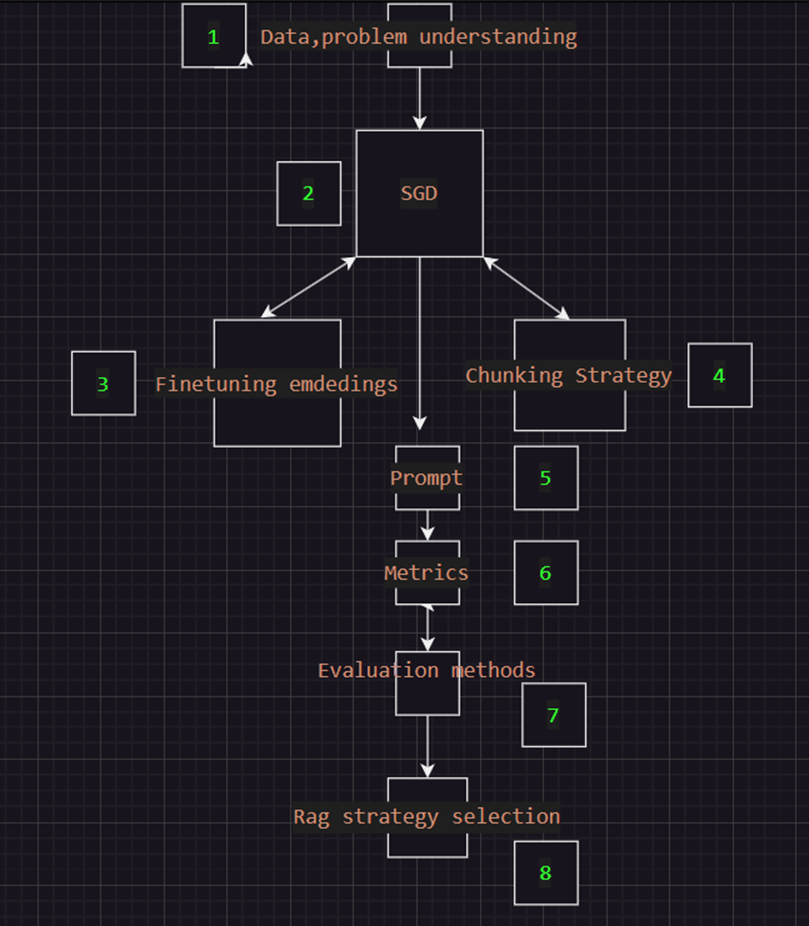

## 1. Data and Problem Understanding

Every initial AI problem revolves around data. An online search was conducted for information related to teaching soft skills, their meanings, relevant documentation, as well as data on teaching and methodologies. The goal was to establish a knowledge base for implementing the RAG system.

## 2. Synthetic Data Generation (SGD)

Once the data on soft skills was gathered, those related to coaching and teaching were filtered out. This provided the necessary context for the chatbot's operation and created a dataset to assess the system to be implemented.

RAGAS was used as a tool to create synthetic data, generating questions and answers from a model (gpt4-mini) exposed to the context of the data.

The generation of a synthetic dataset aims to provide a quick evaluation baseline for the data, as no prior human-generated information exists for questions and answers relevant to the chatbot.

## 3. Fine-Tuning Embeddings

One of the foundations of a RAG system is embeddings. The better the representation of the data, the more effective the search and retrieval will be in the future.

Fine-tuning was performed on an open-source model that produced good results, incorporating insights drawn from PDFs on soft skills. The model was trained on questions and context to evaluate how information is retrieved, with tuning applied to all layers except the output.

## 4. Chunking Strategy

As a chunking strategy, semantic chunking was chosen, which breaks down texts based on their semantic information. This method has proven to be one of the most effective for most text structures, making it easier to retrieve more relevant data from the database depending on the context of the question.

## 5. Prompt

I want you to act as an AI Soft Skills Coach. I will provide you with individuals who wish to improve their soft skills—such as communication, teamwork, leadership, problem-solving, time management, adaptability. Your task is to use the context to provide personalized guidance, offering practical, punctual strategies and actionable steps to help them enhance these skills in both professional and personal contexts. Use relatable examples and scenarios to illustrate your advice, and encourage reflection and self-awareness. Respond in a simple and easy-to-follow way for the user.

The structure of the prompt uses a role-based technique with elements of chain of thought(CoT), as the bot has a specific purpose and needs to provide structured responses to assist users.

## 6. Metrics
The metrics used come from the Ragas framework, which is responsible for creating the dataset, and the following metrics were applied to evaluate the RAG.

Faithfulness: This checks if the AI's answer is factually correct based on the information it was given. If everything in the answer comes from the context provided, the answer is considered faithful. Higher scores mean the AI stayed true to the context.

Answer Relevance: This measures if the AI's answer directly addresses the question. It doesn’t care if the answer is factually correct, just whether it is on-topic and complete. A higher score means the AI’s answer is more relevant to the question.

Context Recall: This checks how well the retrieved information matches what the answer should include. It looks at how much of the correct answer can be found in the context the AI retrieved. Higher scores mean the AI got most of the right information.

Context Precision: This checks if the AI retrieved only the most relevant information needed to answer the question. Higher scores mean the AI pulled exactly the right information without unnecessary details.

Answer Correctness: This measures how close the AI’s answer is to the correct answer, both in meaning and facts. Higher scores mean the AI’s answer is more accurate.

## 7. Evaluation

For the RAG evaluation, two scenarios were considered: a simple retriever and the use of HyDE. No significant differences were observed between the two methods, so the simple method was chosen, as it doesn’t add an extra layer or increase the system’s latency.
Check notebook 'test_rag_datav2'
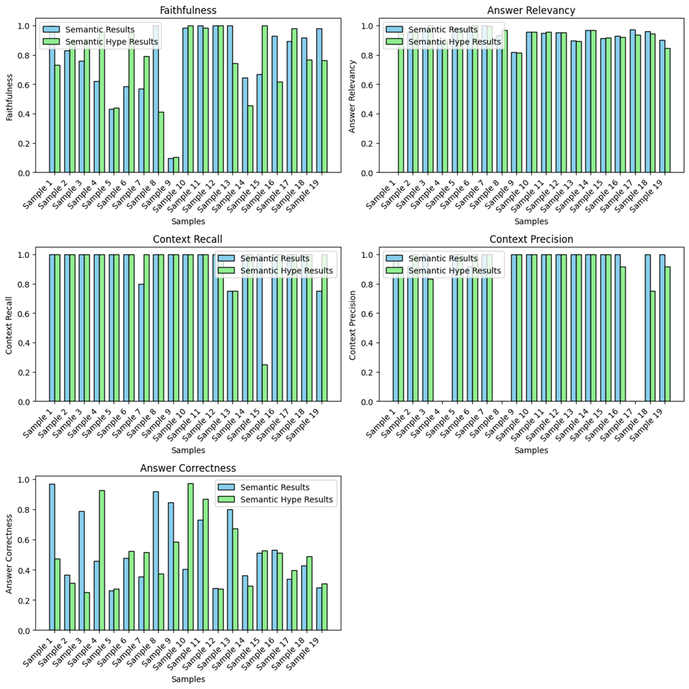

## 8 RAG Strategy selection and deployment

Architecture

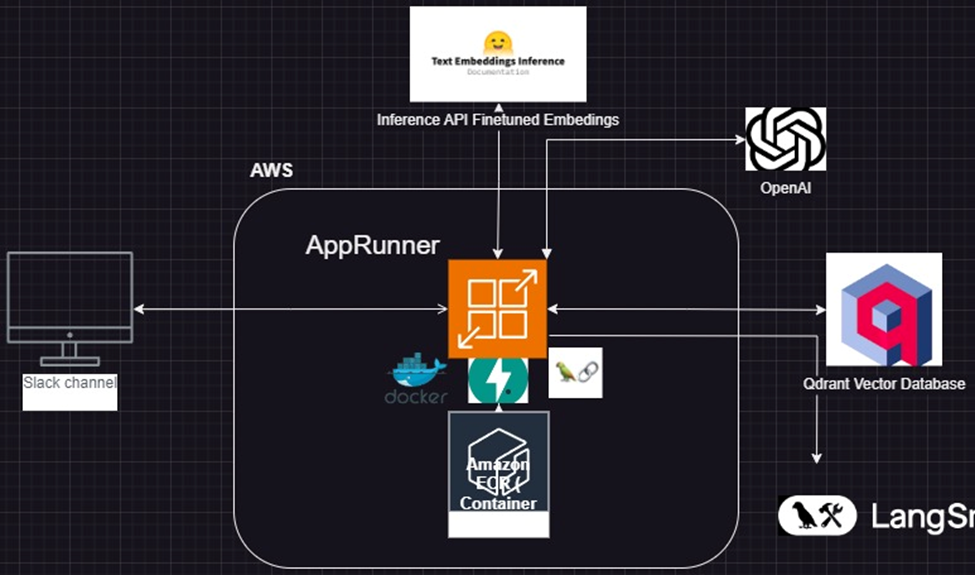

AWS is selected as the primary provider, hosting a Docker container that runs the bot's logic with LangChain and utilizes FastAPI to handle communication with Slack.
This will run on the App Runner service, which allows for serverless deployment of Docker containers (just for testing, since it’s more cost-effective).
This service will communicate with other external services, like OpenAI, using the main model (gpt4-mini) for its balance between cost, speed, and reasoning. To convert incoming text into embeddings, a pre-trained BERT model is used that generates the features (embeddings). This model is deployed on Hugging Face Inferences, on a dedicated instance, after going through a quantization process to improve its inference(check notebook Finetune_embedding_soft)
Qdrant has been chosen for the database because it offers great performance and scalability with its cloud service. It can also be used as a self-managed option in a container; in this case, the cloud version was used on its free tier.

Langsmith was selected for monitoring because it works well with Lanchaing, making them a good pair. This setup helps us see the call flow and manage the entire logical process of the model and its responses.

## 9 Code strucute and folders
# Project Structure

```bash
├── Methodology.drawio
├── README.md
├── datav2
│   ├── doc1.pdf
│   ├── doc2.pdf
│   ├── doc3.pdf
│   └── doc4.pdf
├── evaluation_data
│   ├── test_data.csv
│   └── test_datav1.csv
├── images
│   ├── image-1.png
│   ├── image-10.png
│   ├── image-11.png
│   ├── image-12.png
│   ├── image-2.png
│   ├── image-3.png
│   ├── image-4.png
│   ├── image-5.png
│   ├── image-6.png
│   ├── image-7.png
│   ├── image-8.png
│   ├── image-9.png
│   └── image.png
├── infra
│   ├── main.tf
│   ├── outputs.tf
│   ├── slack_logic
│   │   ├── Dockerfile
│   │   ├── app.py
│   │   ├── functions.py
│   │   ├── model_embedding.py
│   │   ├── requirements.txt
│   │   └── vectorstore_setup.py
│   ├── terraform.tfstate
│   ├── terraform.tfstate.backup
│   ├── terraform.tfvars
│   └── variables.tf
├── notebooks
│   ├── Finetune_embedding_soft.ipynb
│   ├── load_embedding.ipynb
│   ├── load_pdfs.py
│   └── test_rag_datav2.ipynb
└── requirements.txt
```
#### datav2
 consists of collected data from the internet and PDF files related to teaching and coaching soft skills. This data **is crucial for the model's output retrieval and answers**. It serves as a foundation for future improvements, including behavior and content updates, as well as the basis for embedding models.

#### valuation_data
This information comes from the synthetic data generated with **RAGAS** for the evaluation of the RAG, using the knowledge base from the datav2 folder. 

#### infra
In this folder, you'll find the Terraform code to deploy the container that manages the orchestration logic of the RAG, as well as the code in the slack_logic folder, which includes the files with classes and functions for the RAG's operation.

#### notebooks
 Finetune_embedding_soft.ipynb:Training, uploading to the Hugging Face repository, and quantizing the fine-tuned embeddings model, which is deployed as an instance to support the RAG infrastructure.

│load_embedding.ipynb: Initial embedding upload file from local storage to the vector database in Cloud SAS via Qdrant.


load_pdfs.py: fuction helper to read the pdfs files.


test_rag_datav2.ipynb: Comparison of the performance of the RAG system, using a basic system and Hype, with results from the evaluation of the methods with **RAGAS**


## 10 Services implementations

**Apprunner**
The AppRunner service was set up locally using Terraform(folder infra) to create the container repository and service, which provides a URL with an internally configured load balancer on port 5000 of the container.
Prerequisites
1.	AWS Account: Ensure you have an active AWS account with necessary permissions.
2.	Terraform Installed: Install Terraform on your local machine.
3.	Docker Installed: Make sure Docker is installed and your application’s Dockerfile is ready.
4.	AWS CLI Configured: Set up the AWS CLI with credentials that have permissions to create App Runner services, ECR repositories, IAM roles, etc.
Terraform code,  understs the folder **infra **

Deployment process once in the folder
1.  terraform init
2.  terraform validate
3.  terraform plan
4.  terraform apply
5.  Deployment finish on AWS
 
 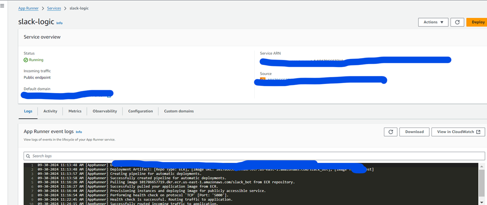


**OpenAI**
A key is created in OpenAI to access the gpt-4mini model.


**Langsmith**
Metrics service implemented with easy integration with Lanchain. Check out the video to follow the tracing. This service can also be used as a self-manager, but in this case, the SaaS service is used for easier integration.

Hugging Face Inferences
To serve the embeddings, the pre-trained model (notebook Finetune_embedding_soft) has been uploaded to the public Hugging Face repository(https://huggingface.co/CamiloGC93/bge-large-en-v1.5-soft-skills). This model is set up to be deployed on a dedicated instance instead of a container managed by Hugging Face, providing a URL that can be accessed from LangChain.

 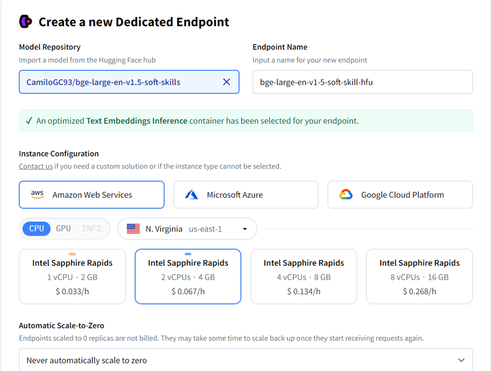

 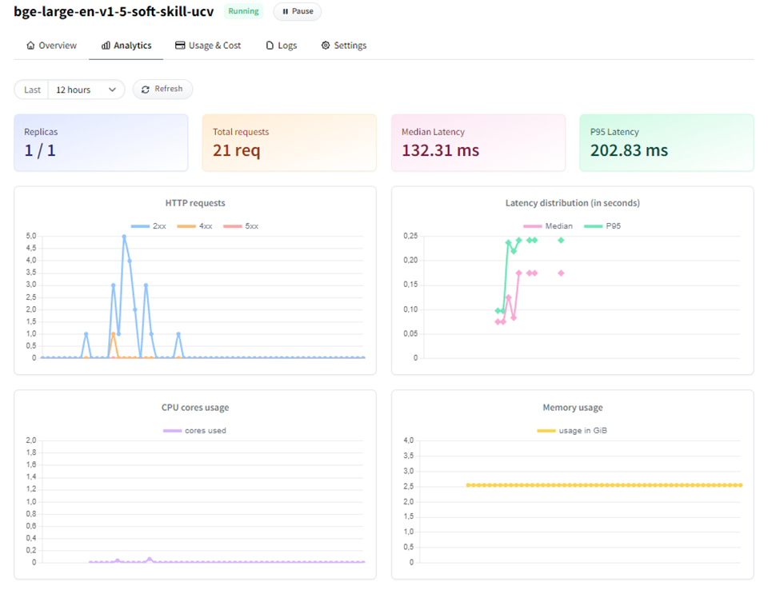
 
**Qdrant**
To use the Qdrant database, create a free account at https://cloud.qdrant.io/. Then, set up a cluster to get the space and URL where you'll store your vectors.
 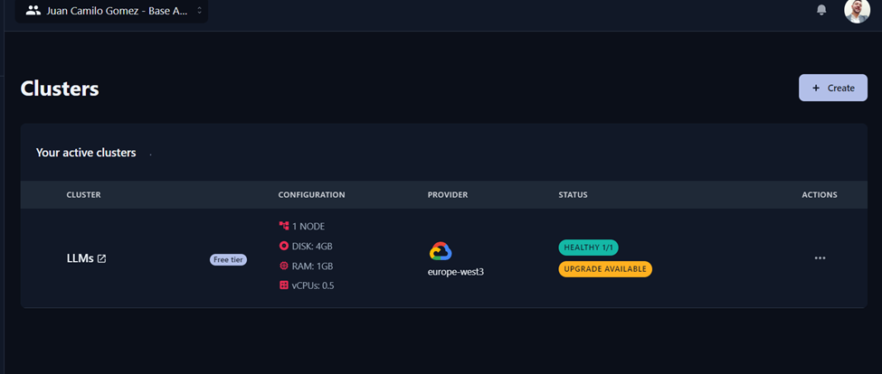

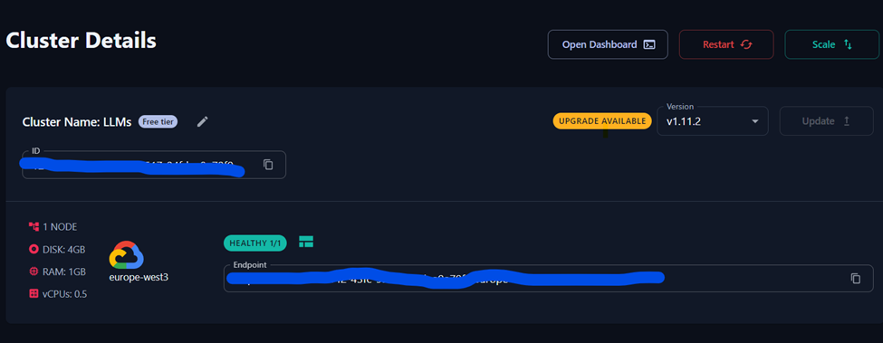

## . Slack Integration Setup

### Step 1: Create a New Slack App

1. Go to [Slack API](https://api.slack.com/apps) and log in.
2. Click "Create New App," provide a name, select a workspace, and click "Create App."

### Step 2: Set up Your Bot

1. Under "Add features and functionality," select "Bots."
2. Click "Add a Bot User," set the name, and save.

### Step 3: Add Bot Permissions

1. Go to "OAuth & Permissions" in the sidebar.
2. Add bot token scopes like `app_mentions:read`, `chat:write`, and `channels:history`.
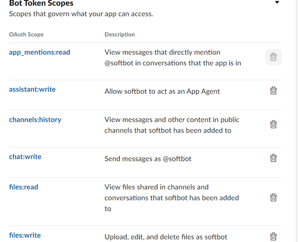
### Step 4: Install the Bot

1. In the sidebar, go to "Basic Information" and click "Install App."
2. Authorize the app.
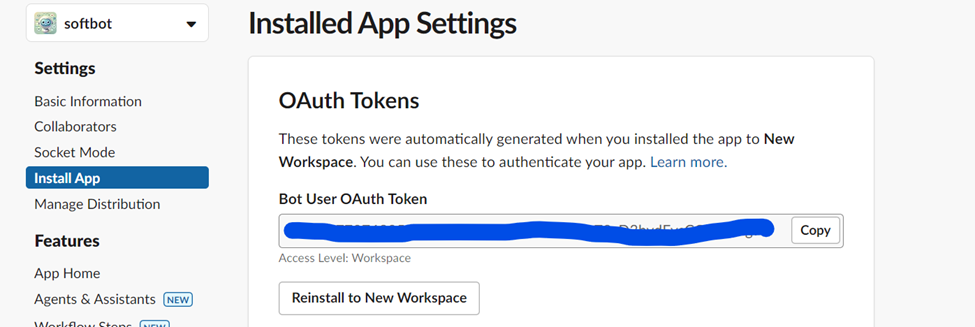
### Step 5: Get the Bot Token

1. After installation, go to "OAuth & Permissions."
2. Copy the "Bot User OAuth Access Token" (`xoxb-...`) for use in your code.

### 6. Deploying the API

Once the API is deployed, enable the Events URL with the AppRunner URL.
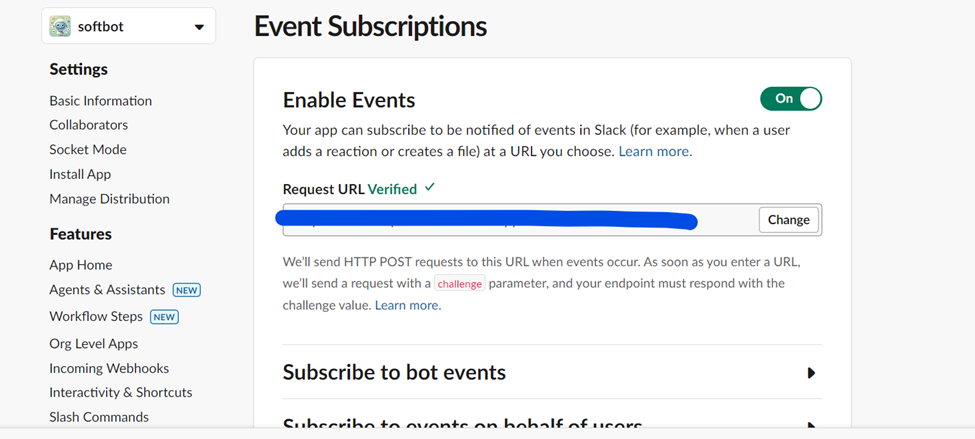

### 7 Next Steps

1. Install the app and save changes.
2. Add the bot to the desired channel.
3. Mention the bot in the channel to start interacting with it.
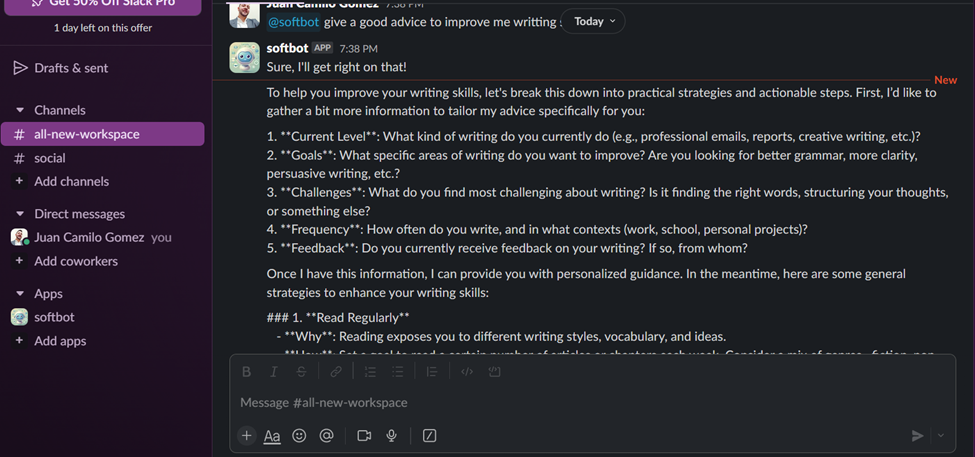


## Current limitations and future improvements.
Right now, the bot lacks a clear data source based on behavior, as its contexts or embeddings come from coaching examples, but they don't generalize to respond to specific behaviors and information styles.

The Serverless Docker instance has a high cold start time, which may result in the loss of the first message after a period of inactivity. This was implemented for testing purposes; typically, Kubernetes or ECS Fargate is used to host the container.

From the RAG side, we could look into other chunking methods that might fit the content of the PDFs or the data source better.

An advanced retrieval method, like a reranker, can be used to optimize information selection in the context of the bot.

The prompt can also be improved by including some examples of questions and their answers to achieve more structured behavior.

To make the system more thoughtful,w e can implement the RAG in an interactive agent that assesses whether the response meets the user's needs. This could function like a series of coaching agents that analyze the content of the responses.


## Voice to text
Slack, by default, transcribes the audio messages sent to our bot into text, so no additional implementation is needed.

To implement this, the Slack file trigger event is used to check if it's an audio file, then an API is called to transcribe the audio, and the text is sent to the prompt.